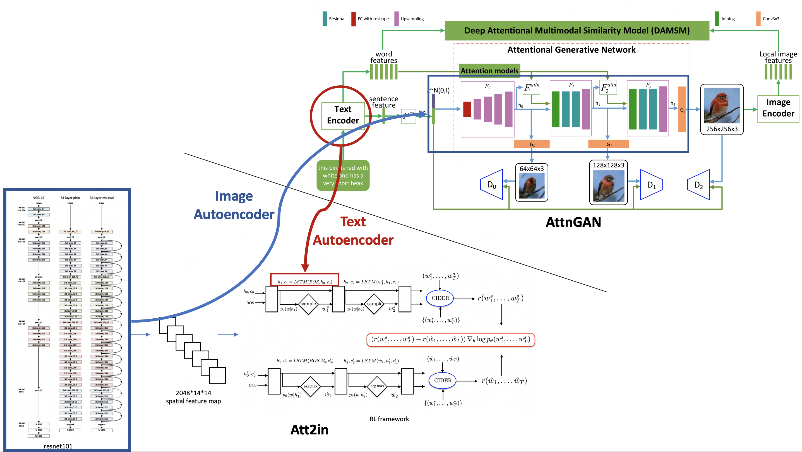
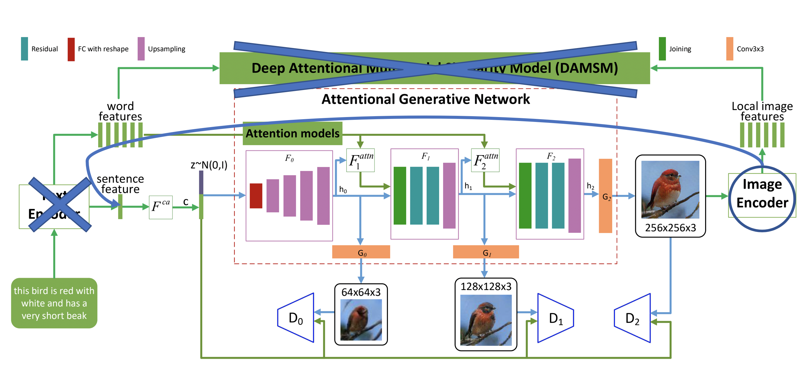

# BUTTER
Bidirectional Unsupervised joinT preTraining with autoEncodeR

## Introduction
A typical image-text conversion model (in either direction) uses an encoder-decoder architecture. We make use of this feature to perform unsupervised pre-training in order to boost model performance.

### First Step: Unsupervised Pre-traing
The rewiring between the **image captioning model** `Att2in` and **text-to-image generator** `AttnGAN` can create one text autoencoder and one image autoencoder, which are used in unsupervised pre-training. This allows us to utilize the unlimited supply of unlabeled data. The purpose of this unsupervised pre-training is to enable encoders 

### Second Step: Supervised Fine-tuning
The autoencoders are rewired back to the original models so that the two models are trained separately with labeled data to achieve their respective training goals.

The rewiring work is shown in the following two figures.

The rewired autoencoders used in unsupervised pre-training is described in the following table.

Autoencoder       | Description 
------------ | ---------- 
 TAEattn | AttnGAN LSTM encoder + Att2in LSTM decoder, with attention
 TAEno attn |  AttnGAN LSTM encoder + Att2in LSTM decoder, without attention 
 IAEresnet | Att2in Resnet101 feature extractor + AttnGAN generator
 IAEattngan |  AttnGAN CNN encoder + AttnGAN GAN, no Att2in involved
